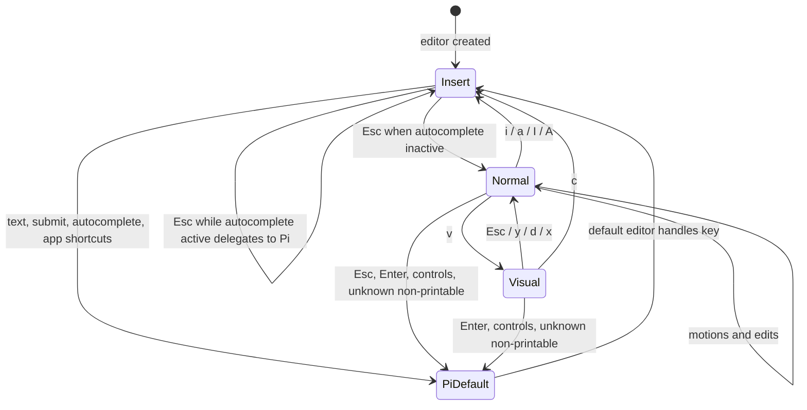

# feat: Build Pi Vim mode extension

## Summary

Build `pi-vimmode` as a package-style Pi extension that replaces Pi's prompt editor with a `CustomEditor`-based Vim editor. Insert mode preserves Pi's default editor/app behavior except inactive `Esc`, which enters Vim normal mode; normal and characterwise visual modes add practical Vim editing while keeping Pi shortcuts available.

---

## Problem Frame

`pi-vim` was somewhat functional but lacked daily-use behavior, especially visual mode. This repo is currently a Bun/TypeScript skeleton, so the plan creates the extension structure, Vim editing core, integration wrapper, tests, and docs from scratch using the OpenSpec change as source of truth.

---

## Requirements

- R1. The extension registers a Pi `CustomEditor` replacement during session startup without requiring Pi core changes.
- R2. Insert mode starts by default and preserves Pi's normal editor behavior, autocomplete, prompt submission, and app shortcuts except inactive `Esc`, which enters normal mode.
- R3. Normal mode supports core navigation: `h`, `j`, `k`, `l`, `0`, `$`, `w`, and `b`.
- R4. Normal mode supports core editing: `i`, `a`, `I`, `A`, `x`, `dd`, `yy`, `p`, and `u`.
- R5. Characterwise visual mode supports `v`, motion extension, `y`, `d`/`x`, `c`, and `Esc` cancel.
- R6. Mode feedback is visible and render-width safe, using `INSERT`/`NORMAL`/`VISUAL` when space allows and `I`/`N`/`V` at narrow widths.
- R7. Pi application shortcuts and safety behavior remain compatible across modes.
- R8. Vim behavior is covered by Bun tests for pure logic plus focused integration tests for key delegation/rendering, and the README documents install, keymap, validation, and limitations.

---

## Scope Boundaries

- No full Vim parity: no block visual mode, visual line mode, search, ex commands, macros, marks, named registers, or system clipboard integration in v1.
- No Pi core patches and no private editor state mutation for cursor placement unless a public-only restoration spike proves impossible and the plan is updated first.
- No perfect visual selection highlighting across wrapped terminal lines in v1; visual mode must be functional and clearly indicated.
- No broad TUI rewrite; this is prompt-editor behavior only.

### Deferred to Follow-Up Work

- Rich visual selection highlighting across wrapped lines: defer until core visual operations are stable.
- Grapheme-cluster-perfect editing parity: defer unless implementation reveals Pi exposes matching cursor utilities.
- System clipboard/register integration: defer until local unnamed register behavior is reliable.

---

## Context & Research

### Relevant Code and Patterns

- `package.json`: Bun/TypeScript package scaffold; needs Pi extension manifest, package dependency shape, and test script.
- `tsconfig.json`: strict ESM TypeScript config; source should live under `src/` and compile with current settings.
- `README.md`: starter Bun README; replace with extension docs.
- `openspec/changes/add-vim-mode-extension/proposal.md`: motivation and scope.
- `openspec/changes/add-vim-mode-extension/design.md`: `CustomEditor` integration decision and public cursor-restoration constraint.
- `openspec/changes/add-vim-mode-extension/specs/vim-mode-editor/spec.md`: normative behavior requirements.
- Pi bundled Custom Editor docs and modal editor examples: use `CustomEditor`, `ctx.ui.setEditorComponent()`, `matchesKey()`, `visibleWidth()`, and `truncateToWidth()`; delegate unhandled input to `super.handleInput(data)`.
- Pi bundled border-status editor example: use border/status rendering with ANSI-aware fitting rather than appending labels blindly.

### Institutional Learnings

- No repo-local `docs/solutions/` learnings exist for this package.
- Sibling Pi extension learnings favor small package-style extensions: thin `src/index.ts`, separate implementation modules, deterministic Bun tests for pure logic, and README as the user-facing contract.

### External References

- External web research skipped. Bundled Pi docs/examples are the authoritative API references for this extension layer, and the feature has no security/payment/data-migration surface.

---

## Key Technical Decisions

- Use `CustomEditor`, not keybinding config or the `input` event: modes and visual selection require per-key state before prompt submission; `CustomEditor` preserves app shortcuts when unhandled keys delegate to `super.handleInput(data)`.
- Keep Vim core pure and integration thin: range math, registers, command parsing, and line/char operations live in pure modules; `VimEditor` coordinates editor state and Pi delegation.
- Prefer Pi compatibility over strict Vim conflicts: insert mode delegates default editing except inactive `Esc`; normal/visual only intercept recognized Vim printable commands; unknown control and non-printable sequences delegate to Pi.
- Delegate `Enter` to Pi in normal and visual modes after resetting transient Vim state and mode to insert: prompt submission remains available even when the user finishes editing outside insert mode, and the next prompt starts in insert mode.
- Use Pi native undo for `setText()` structural edits unless implementation proves it is not recorded by the installed editor: review found Pi's `setText()` already pushes undo snapshots, so a second extension-local undo stack would risk double-undo/stale restore behavior.
- Treat Pi editor cursor coordinates as the v1 canonical text unit: helpers operate against the same string-column coordinates Pi returns; Unicode-perfect grapheme behavior is documented as a limitation unless implementation finds a public Pi utility.
- Use Vim-like inclusive visual ranges: visual selection includes the anchor and cursor endpoints; delete/change restore cursor to normalized range start.
- Keep one unnamed register with linewise and charwise variants: all yank/delete/change operations update it; `p` no-ops when empty, linewise paste inserts after the current line, charwise paste inserts after the cursor.
- Make pending commands one-key and self-clearing: `d`/`y` wait for the next key only; invalid printable keys clear pending state, and control/non-printable keys clear pending state then delegate to Pi.
- When autocomplete is active in insert mode, delegate `Esc` to Pi and remain in insert mode after that key: completion dismissal should not leave Pi's popup state confused.
- Put mode feedback in the editor border/status area: left side shows mode/pending status, right side shows visual selection summary when present. If width is too narrow, shorten mode to `I`/`N`/`V`, then drop secondary selection details before hiding primary mode.

---

## Open Questions

### Resolved During Planning

- Should normal/visual `Enter` submit? Resolved: yes, delegate to Pi because prompt submission is a core Pi action; reset Vim state to insert before delegation so the next prompt is not stuck in normal/visual.
- Should `u` require an extension-local undo stack? Resolved: no for v1. Pi's editor appears to record `setText()` changes in native undo; start with Pi undo and add local undo only if implementation proves native undo misses a required edit path.
- Should v1 promise Unicode/grapheme-perfect edits? Resolved: no; v1 follows Pi cursor coordinates and documents Unicode edge limitations rather than inventing a mismatched coordinate system.
- Should autocomplete-active `Esc` also enter normal mode? Resolved: no. If autocomplete is active, `Esc` is Pi-owned for that key and editor mode remains insert.

### Deferred to Implementation

- Exact public cursor restoration mechanics: U3 must prove a deterministic public-only restore path before structural edits ship.
- Exact package dependency declaration syntax after verifying local type resolution against installed Pi packages.
- Whether `src/cursor.ts` is justified as a separate module; inline cursor helpers in `vim-editor.ts` if no second consumer appears.

---

## Output Structure

    src/
      index.ts
      vim-editor.ts
      types.ts
      buffer.ts
      commands.ts
      cursor.ts        # optional; extract only if cursor helpers outgrow vim-editor.ts
    test/
      buffer.test.ts
      commands.test.ts
      vim-editor.test.ts
    docs/plans/
      2026-05-26-001-feat-vim-mode-extension-plan.md
    README.md
    package.json

This tree is the intended shape. The implementer may adjust module boundaries if implementation reveals a simpler structure, but should keep pure Vim logic separate from Pi integration.

---

## High-Level Technical Design

> *This illustrates the intended approach and is directional guidance for review, not implementation specification. The implementing agent should treat it as context, not code to reproduce.*

| Mode | Extension handles | Pi delegates | State cleanup |
|------|-------------------|--------------|---------------|
| Insert | Inactive `Esc` to normal | Printable text, submit, newline, autocomplete, image paste, external editor, app shortcuts | Starts as default mode |
| Normal | Vim printable commands and pending `d`/`y` | `Esc`, `Enter`, controls, unknown non-printable sequences | `Enter`/clear-like actions reset mode to insert before delegation |
| Visual | Motions, `y`, `d`/`x`, `c`, `Esc` | `Enter`, controls, unknown non-printable sequences | Delegated submit/clear-like actions clear selection and reset to insert |

| Feedback item | Normal width | Narrow fallback | Drop order |
|---------------|--------------|-----------------|------------|
| Mode | `INSERT`, `NORMAL`, `VISUAL` | `I`, `N`, `V` | Never drop if width permits one char |
| Pending operator | `d…` or `y…` beside mode | one-character operator | Drop after mode only if width is too small |
| Visual summary | selection size/range on right | shorter count | Drop before mode/pending |

---

## Implementation Units

### U1. Package scaffold

**Goal:** Prepare the package for Pi loading and local validation.

**Requirements:** R1, R8

**Dependencies:** None

**Files:**
- Modify: `package.json`

**Approach:**
- Add the Pi extension manifest pointing at `./src/index.ts`.
- Add a Bun test script while keeping the existing typecheck script.
- Add Pi core packages as peer dependencies/runtime metadata as required by the installed Pi docs, then add local dev/typecheck dependency guidance only if imports do not resolve.
- Verify the package uses the documented import scope for this installed Pi version before code modules depend on it.

**Patterns to follow:**
- Existing `package.json` ESM/Bun setup.
- Pi extension package docs for manifest and dependency shape.

**Test scenarios:**
- Test expectation: none -- package metadata has no behavior by itself.

**Verification:**
- Package metadata exposes the extension entrypoint.
- Pi imports can be resolved for local typecheck and runtime loading.

---

### U2. Pure Vim buffer and command core

**Goal:** Build deterministic, testable logic for text ranges, registers, line/char operations, and command parsing.

**Requirements:** R3, R4, R5, R8

**Dependencies:** U1

**Files:**
- Create: `src/types.ts`
- Create: `src/buffer.ts`
- Create: `src/commands.ts`
- Test: `test/buffer.test.ts`
- Test: `test/commands.test.ts`

**Approach:**
- Define shared types for mode, position, normalized range, register kind, edit result, and pending command state.
- Implement range normalization for forward/reverse same-line and multiline selections.
- Implement selected-text extraction, charwise delete/change, linewise delete/yank/paste, and empty-buffer preservation.
- Implement one-key pending parser behavior for `dd` and `yy`; invalid printable keys clear pending state.
- Keep this unit independent of Pi runtime imports.

**Execution note:** Implement new behavior test-first because this unit carries most off-by-one risk.

**Patterns to follow:**
- Existing `tsconfig.json` strict typing.
- Bun test style from project guidance.

**Test scenarios:**
- Happy path: normalize a forward same-line visual range and extract exactly the inclusive selected text.
- Happy path: normalize a reversed multiline range and extract text preserving embedded newlines.
- Happy path: delete a charwise visual range and return updated text plus target cursor at range start.
- Happy path: `yy` stores current line as linewise register and `p` inserts it after the current line.
- Edge case: `dd` on the only line leaves an editable empty prompt and cursor at start.
- Edge case: `x` or charwise delete at end-of-line no-ops when no character exists.
- Edge case: paste with an empty register no-ops and preserves cursor/text.
- Edge case: pending `d` followed by an invalid printable key clears pending state without editing.

**Verification:**
- Pure tests cover range math, linewise operations, charwise operations, register behavior, and command parser state.

---

### U3. Extension entrypoint, editor shell, and cursor-restoration spike

**Goal:** Register a working Vim editor component, establish safe mode transitions/delegation, and prove cursor restoration before destructive edits depend on it.

**Requirements:** R1, R2, R6, R7

**Dependencies:** U1, U2

**Files:**
- Create: `src/index.ts`
- Create: `src/vim-editor.ts`
- Test: `test/vim-editor.test.ts`

**Approach:**
- Export the Pi extension factory from `src/index.ts` and register the custom editor on `session_start`.
- Implement `VimEditor extends CustomEditor` with startup mode `insert`.
- In insert mode, delegate everything except inactive-autocomplete `Esc` to `super.handleInput(data)`.
- If autocomplete is active, delegate `Esc` and remain in insert mode for that key.
- In normal/visual modes, ignore unmapped printable keys and delegate unknown control/non-printable sequences.
- Prove a deterministic public-only cursor restore path with focused tests before U4/U5 structural edits are built. Cover multiline, empty, end-of-line, and long-line/wrapped prompt cases where possible.
- Use installed Pi `CustomEditor`/keybinding wiring in at least one smoke or integration-shaped test path; a fake harness can supplement but not replace this check.

**Patterns to follow:**
- Pi bundled Custom Editor docs, modal editor example, and border-status editor example.
- Existing OpenSpec decision to avoid private editor internals.

**Test scenarios:**
- Happy path: session registration creates a Vim editor component factory.
- Happy path: editor starts in insert mode.
- Happy path: insert printable text delegates to default editor behavior.
- Happy path: insert `Esc` enters normal mode when autocomplete is inactive.
- Edge case: insert `Esc` delegates and remains insert when autocomplete is active.
- Edge case: public cursor restore returns to the requested cursor after text rewrite on multiline input.
- Edge case: cursor restore clamps safely for empty lines and end-of-line targets.
- Integration: normal-mode `Esc`, `Enter`, and control shortcuts delegate to Pi rather than being swallowed.
- Integration: unmapped printable keys in normal mode do not insert text.

**Verification:**
- Extension loads through the declared entrypoint.
- Mode transitions and delegation matrix are covered by tests or a documented smoke harness.
- Cursor restoration has a proven public-only path before structural edit units proceed.

---

### U4. Normal-mode motions, edits, register, and undo

**Goal:** Implement the practical normal-mode Vim keymap while preserving Pi behavior for non-Vim shortcuts.

**Requirements:** R3, R4, R7, R8

**Dependencies:** U2, U3

**Files:**
- Modify: `src/vim-editor.ts`
- Modify: `src/buffer.ts`
- Modify: `src/commands.ts`
- Create: `src/cursor.ts` (optional; inline if cursor helpers stay small)
- Test: `test/buffer.test.ts`
- Test: `test/commands.test.ts`
- Test: `test/vim-editor.test.ts`

**Approach:**
- Implement `h/j/k/l`, `0`, `$`, `w`, and `b` through public Pi editor movements or the cursor path proven in U3.
- Implement `i`, `a`, `I`, and `A` as mode transitions with cursor movement before entering insert when needed.
- Implement `x`, `dd`, `yy`, and `p` using pure helpers and cursor restoration.
- Track unnamed register kind and contents inside the editor instance.
- Make `u` delegate to Pi native undo for v1; add local undo only if implementation proves native undo does not cover a required `setText()` edit path and the plan/spec are updated first.
- Keep pending command state one-key and clear it before delegating control shortcuts.

**Patterns to follow:**
- Public editor APIs only: read text/cursor, write text, then restore cursor via the U3-proven public path.
- OpenSpec design constraint: no private cursor state mutation.

**Test scenarios:**
- Happy path: `h/j/k/l` move cursor when possible and clamp at boundaries.
- Happy path: `0` and `$` move to current line start/end.
- Happy path: `i/a/I/A` enter insert at expected positions.
- Happy path: `x` deletes the character under the cursor and stores charwise register content.
- Happy path: `dd` removes the current line, stores linewise register content, and restores cursor to a valid line.
- Happy path: `yy` then `p` duplicates the current line below it.
- Happy path: charwise register paste inserts after cursor.
- Happy path: `u` invokes Pi native undo after a Vim structural edit.
- Edge case: `dd` on the last line and only line preserves editable prompt state.
- Edge case: pending command followed by `Esc` or control sequence clears pending and preserves Pi delegation.
- Integration: mixed insert edit, Vim structural edit, and repeated `u` follow Pi undo order without double-restoring stale text.

**Verification:**
- Normal-mode commands satisfy the keymap without stealing Pi controls.
- Cursor restoration is stable after structural edits.
- Undo behavior uses one authority and does not maintain conflicting local/native stacks.

---

### U5. Characterwise visual mode

**Goal:** Add functional visual selection operations with clear anchor/range state and predictable exits.

**Requirements:** R5, R6, R7, R8

**Dependencies:** U2, U3, U4

**Files:**
- Modify: `src/vim-editor.ts`
- Modify: `src/buffer.ts`
- Test: `test/buffer.test.ts`
- Test: `test/vim-editor.test.ts`

**Approach:**
- Enter visual mode on `v` from normal mode and store the anchor cursor.
- Reuse supported motion keys to move the active cursor and recompute normalized inclusive range.
- Implement visual `y`, `d`/`x`, and `c` using pure selection helpers and unnamed register updates.
- Clear selection and pending state on all visual exits.
- Delegate normal Pi control/non-printable shortcuts from visual mode after clearing transient state where needed.
- Minimum v1 selection visibility is mode label plus selection size/range; if width permits, include a short selected-text preview. Do not allow destructive visual commands without at least the mode label being visible.

**Execution note:** Add characterization-style tests for same-line, reversed, and multiline selections before wiring them into `VimEditor`.

**Patterns to follow:**
- Pure range helpers from U2.
- Normal-mode movement/delegation helpers from U4.

**Test scenarios:**
- Happy path: `v` anchors at current cursor and enters visual mode.
- Happy path: visual motions extend selection while preserving anchor.
- Happy path: visual `y` copies selected text, clears selection, and returns normal.
- Happy path: visual `d` and `x` delete selected text, update register, restore cursor to range start, and return normal.
- Happy path: visual `c` deletes selected text, updates register, restores cursor, and enters insert.
- Edge case: reversed selection deletes/yanks the same text as forward selection.
- Edge case: multiline selection deletes/yanks text with newline boundaries preserved.
- Edge case: visual `Esc` clears selection without changing text.
- Integration: visual `Enter` clears visual state, resets mode to insert, and delegates to Pi submit.

**Verification:**
- Visual mode solves the missing `pi-vim` capability: selection can be created, moved, yanked, deleted, changed, and cancelled.
- Destructive visual actions are never available with completely hidden mode feedback.

---

### U6. Width-safe feedback and lifecycle compatibility

**Goal:** Make mode/status feedback visible while keeping render output width-safe and avoiding stale mode state across prompt lifecycle events.

**Requirements:** R2, R6, R7, R8

**Dependencies:** U3, U4, U5

**Files:**
- Modify: `src/vim-editor.ts`
- Test: `test/vim-editor.test.ts`

**Approach:**
- Render feedback in the editor border/status area using ANSI-aware fitting helpers.
- Left feedback priority: mode first, then pending operator (`d…`/`y…`). Right feedback priority: visual selection count/range, then optional selected-text preview.
- At narrow widths, truncate right-side visual details first, abbreviate mode to `I`/`N`/`V` second, and preserve at least one-character mode feedback when width allows.
- Reset visual/pending state and mode to insert before delegating submit, clear, external editor, or app control flows that can replace/clear prompt text.
- Clear extension-owned transient undo/cursor restoration state on prompt-reset flows; keep unnamed register scoped to the editor session unless implementation reveals session reset semantics require clearing it.

**Patterns to follow:**
- Pi TUI width helpers and border-status editor fitting pattern.

**Test scenarios:**
- Happy path: render output includes the active mode label after mode switches.
- Happy path: pending `d`/`y` state shows and clears after invalid key, `Esc`, control shortcut, and completed command.
- Happy path: visual render output includes selection summary when a selection exists.
- Edge case: very narrow widths use abbreviated mode labels without exceeding render width.
- Edge case: Unicode or ANSI-colored feedback still satisfies visible-width constraints.
- Integration: submit/clear/external-editor delegation resets mode to insert and does not leave stale visual or pending state.

**Verification:**
- Rendered editor lines never exceed the width supplied by Pi.
- User can always tell which mode is active when terminal width permits any label.
- New prompts after delegated reset flows start in insert mode.

---

### U7. README, validation, and manual smoke coverage

**Goal:** Make the extension usable and verifiable by a future implementer or local user.

**Requirements:** R8

**Dependencies:** U1, U2, U3, U4, U5, U6

**Files:**
- Modify: `README.md`
- Modify: `package.json`
- Test: `test/buffer.test.ts`
- Test: `test/commands.test.ts`
- Test: `test/vim-editor.test.ts`

**Approach:**
- Replace starter README with purpose, install/loading instructions, keymap, mode semantics, compatibility notes, validation guidance, and known limitations.
- Document conflict decisions: `Enter` delegates and resets to insert for the next prompt, normal `Esc` delegates, autocomplete `Esc` remains insert, register semantics, Pi-native undo behavior, feedback placement, and Unicode limitations.
- Ensure package scripts cover automated tests and typechecking.
- Add a manual smoke checklist for local Pi usage without turning it into shell-command choreography.

**Patterns to follow:**
- README as public contract for Pi extension behavior.
- OpenSpec requirements as source for supported behavior list.

**Test scenarios:**
- Test expectation: none -- documentation itself has no runtime behavior; runtime behavior is covered by U2-U6 tests.

**Verification:**
- README accurately describes current behavior and limitations.
- Automated tests and typechecking complete successfully.
- Manual smoke covers mode switching, normal edits, visual yank/delete/change, prompt submit, normal-mode interrupt behavior, and next-prompt insert-mode reset.

---

## System-Wide Impact

- **Interaction graph:** Pi session startup creates the editor component; editor key input flows either to Vim command handling or to Pi's default editor/app shortcut path.
- **Error propagation:** Extension load/type errors should fail visibly during local validation; there is no persisted runtime migration to recover.
- **State lifecycle risks:** Mode, visual anchor, pending command, register, and any transient restoration state live in the editor instance. Visual/pending state and mode must reset before delegated actions that can submit, clear, or replace the prompt.
- **API surface parity:** The package entrypoint and README are the public surface. No Pi core APIs or external app APIs change.
- **Integration coverage:** Pure tests prove buffer semantics; editor tests/smoke tests prove mode delegation, cursor restoration, render-width behavior, and prompt lifecycle reset.
- **Unchanged invariants:** Insert-mode text editing, autocomplete, submit, external editor, image paste, model/thinking shortcuts, clear, exit, and normal-mode Pi interrupt remain Pi-owned behaviors unless explicitly handled by this extension.

---

## Risks & Dependencies

| Risk | Mitigation |
|------|------------|
| `setText()` resets cursor to end of buffer | Make public cursor restoration a U3 gate before structural edits; cover multiline, empty, EOL, and long-line cases. |
| Dual undo stacks can corrupt history | Use Pi native undo for v1 because `setText()` appears to push undo snapshots; do not add a local undo stack unless evidence requires a plan/spec update. |
| Normal/visual submit can leave next prompt outside insert mode | Reset mode to insert before delegating submit/clear-like flows; test next-prompt lifecycle behavior. |
| Visual selection without highlight may feel incomplete | Ship functional visual operations plus visible `VISUAL`/selection feedback and optional preview; defer rich highlighting. |
| Shortcut regression from swallowed control keys | Treat unknown control/non-printable sequences as Pi-owned and cover delegation in tests/smoke checks. |
| Autocomplete conflict on `Esc` | Check autocomplete state in insert mode, delegate `Esc` when completion is active, and remain insert for that key. |
| Import/package scope mismatch across Pi versions | Make manifest/dependency resolution a U1 exit criterion before implementation modules depend on Pi imports. |
| Unicode cursor semantics mismatch | Use Pi cursor coordinates consistently and document v1 limitations; defer grapheme-perfect support. |

---

## Documentation / Operational Notes

- README should be updated in the same change as code; it is the user-facing contract for supported Vim behavior.
- This plan intentionally narrows undo behavior back to the current OpenSpec `u` requirement by using Pi native undo for v1.
- If implementation discovers a need to change OpenSpec requirements, update OpenSpec explicitly before continuing rather than quietly letting implementation drift.
- No rollout, migration, or production monitoring is required. Disabling the extension returns Pi to the default editor.

---

## Sources & References

- **Origin proposal:** `openspec/changes/add-vim-mode-extension/proposal.md`
- **Origin design:** `openspec/changes/add-vim-mode-extension/design.md`
- **Origin spec:** `openspec/changes/add-vim-mode-extension/specs/vim-mode-editor/spec.md`
- **Origin tasks:** `openspec/changes/add-vim-mode-extension/tasks.md`
- Related package files: `package.json`, `tsconfig.json`, `README.md`
- Pi reference: bundled Custom Editor docs, modal editor example, and border-status editor example from installed Pi documentation/examples
