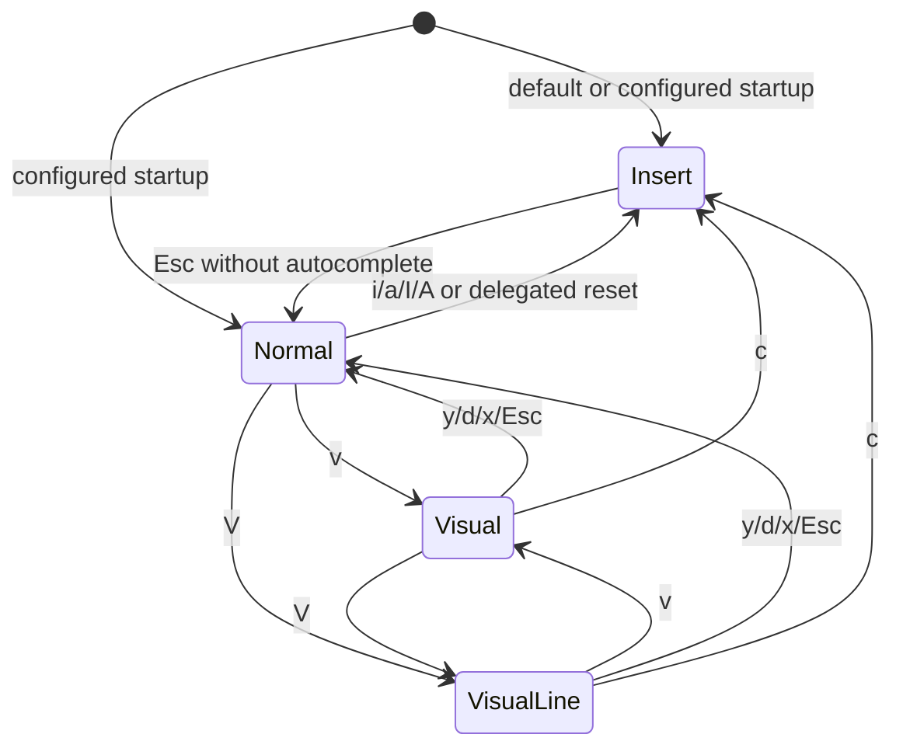

# feat: Enhance visual modes and cursors

## Summary

Add visible visual-selection feedback, first-class visual line mode, startup-mode settings, and per-mode cursor styles to the Pi Vim prompt editor while preserving `CustomEditor` delegation and the existing pure editing-helper structure.

| Mode        | Existing behavior                                  | Planned behavior                                          |
| ----------- | -------------------------------------------------- | --------------------------------------------------------- |
| Insert      | Default Pi editing path                            | Configurable startup target; bar cursor by default        |
| Normal      | Vim command mode                                   | Block cursor by default; unchanged Pi shortcut delegation |
| Visual      | Characterwise operations with status-only feedback | Inline highlighted selection plus configured cursor style |
| Visual Line | Not supported                                      | Whole-line selection and linewise operations via `V`      |

---

## Problem Frame

The current extension already supports practical Vim-style prompt editing, but visual mode is hard to trust because selected text is only summarized in the status border. Users also cannot configure startup mode or cursor presentation, so the editor does not yet feel like a modal terminal editor across insert, normal, and visual states.

---

## Requirements

- R1. Highlight active characterwise visual selections inline without changing prompt text.
- R2. Keep every rendered editor line within the terminal width while visual highlighting is active.
- R3. Add `visualLine` as a first-class Vim mode entered with `V` from normal mode.
- R4. Support linewise visual yank, delete, change, cancel, and motion behavior over full selected lines.
- R5. Allow switching between characterwise visual mode and visual line mode without losing the active anchor.
- R6. Support a read-only, namespaced startup mode setting with `insert` as the default and `normal` as the only other valid startup mode.
- R7. Support per-mode cursor style settings for `insert`, `normal`, `visual`, and `visualLine`, with invalid values falling back per field.
- R8. Preserve Pi app shortcut behavior, prompt submission, autocomplete escape behavior, and default insert-mode editing.
- R9. Update tests and README coverage for highlighting, visual line mode, settings, cursor styles, compatibility, and limitations.

---

## Scope Boundaries

- No block visual mode, visual block operations, search, ex commands, marks, macros, named registers, or system clipboard integration.
- No Pi core patches and no dependency on private Pi editor state for cursor movement or rendering.
- No full Neovim cursor option parity: blink timing, terminal-specific negotiation, and environment-specific cursor behavior stay out of scope.
- No exact grapheme-cluster Vim parity beyond the cursor/column semantics already exposed by Pi's editor.
- No write-back or migration of Pi settings files; the extension only reads supported `piVimMode` fields.

### Deferred to Follow-Up Work

- Theme-configurable visual selection colors: defer until Pi exposes or documents a selection-style theme contract.
- CLI flag overrides for Vim settings: defer unless users need session-local overrides after persistent settings land.

---

## Context & Research

### Relevant Code and Patterns

- `src/vim-editor.ts`: `VimEditor extends CustomEditor`, mode dispatch, status-border rendering, motion delegation through Pi key inputs, transient visual/pending state handling.
- `src/buffer.ts`: pure text/range/register helpers returning `EditResult`; this is the pattern for linewise visual operations.
- `src/commands.ts`: small pure command parser for pending normal-mode operators.
- `src/types.ts`: shared mode, range, register, command, and edit-result types.
- `src/index.ts`: stable editor factory and idempotent install hooks across `session_start`, `resources_discover`, and `agent_end`.
- `test/buffer.test.ts`, `test/commands.test.ts`, `test/vim-editor.test.ts`: Bun-based unit/integration tests for pure helpers and editor behavior.
- Pi TUI public surface: `CustomEditor` exposes text, lines, cursor, `setText()`, `insertTextAtCursor()`, `render()`, and `handleInput()`; root exports include width/truncation utilities and `CURSOR_MARKER`; span-preserving wrapping requires the documented editor component subpath for `wordWrapLine` or a local wrapper fallback.

### Institutional Learnings

- `docs/solutions/developer-experience/pi-vimmode-auto-activation-2026-05-26.md`: keep a stable editor factory, install on multiple lifecycle events, retry next tick, and preserve package discovery through `pi.extensions`.
- `openspec/changes/add-vim-mode-extension/design.md`: keep `CustomEditor` as the integration boundary, delegate unhandled inputs to Pi, avoid private cursor mutation, and keep buffer/command logic pure and testable.
- `openspec/changes/enhance-visual-modes-and-cursors/design.md`: make `visualLine` explicit, keep linewise operations pure, scope custom rendering to active visual selections, and treat terminal cursor escapes as best-effort.

### External References

- External research skipped. This work is specific to local Pi extension and Pi TUI APIs, and the repo already contains direct patterns for editor integration, modal state, pure buffer helpers, and tests.
- Slack context was not requested.

---

## Key Technical Decisions

- Make `visualLine` a separate `VimMode`: cursor config, status labels, mode transitions, and tests are clearer than a hidden visual-kind flag.
- Use canonical user-facing labels: `INSERT`, `NORMAL`, `VISUAL`, and `V-LINE` at normal widths; narrow rendering may shorten them but README/tests should use the same source labels.
- Keep linewise visual operations in `src/buffer.ts`: editor integration should apply pure `EditResult` values rather than embedding line-deletion and register logic in `VimEditor`.
- Store visual-line register text as newline-joined line contents without adding a trailing newline: this preserves existing linewise paste semantics in `pasteRegister()`.
- Use the editor component subpath for `wordWrapLine` if typecheck accepts it; otherwise implement a local span-preserving wrapper in `src/render.ts` using root-public width utilities.
- Add a scoped active-visual render helper for selection styling and a smaller cursor-only post-process for non-visual modes: insert/normal rendering should preserve `super.render(width)` layout while replacing Pi's fake cursor only when the `CURSOR_MARKER` makes that safe.
- Render selected empty visual-line rows with one highlighted blank cell when width permits; cursor styling takes precedence when the cursor is on that cell.
- Read settings from Pi's global agent settings source and project `.pi/settings.json`, with project values overriding global values field-by-field and reload timing tied to editor install/editor construction rather than every render.
- Use ANSI reverse-video selection highlighting first: it is width-neutral, dependency-free, and compatible with existing terminal output; a theme token can replace it later if Pi exposes one.
- Keep the editor factory identity stable while letting settings refresh through mutable options or construction-time reads: this preserves auto-activation reliability from the existing install pattern.
- Treat terminal cursor-shape escape sequences as enhancement, not correctness: rendered fake cursor styling is the testable source of truth; terminal writes should be guarded and best-effort.

---

## Open Questions

### Resolved During Planning

- Should visual line be a separate mode or a sub-kind of visual mode? Resolved as a separate `visualLine` mode for explicit cursor settings, status labels, and key handling.
- Should settings require Pi core changes? Resolved as read-only extension parsing of a namespaced `piVimMode` object from existing Pi settings files.
- Should external research be used? Resolved as unnecessary because the relevant API and behavior are local to Pi and this extension.

### Deferred to Implementation

- Exact helper names and file boundaries inside the render helper: decide during implementation while preserving the planned `src/render.ts` testing boundary if it remains the simplest shape.
- Exact visual style escape sequence composition: keep tests focused on visible width, selected-span presence, and cursor precedence rather than brittle full-line strings.
- Exact terminal crash/kill cleanup behavior: reset on normal lifecycle hooks and document that process crashes may leave terminal cursor shape to the user's shell/terminal reset behavior.

---

## High-Level Technical Design

> _This illustrates the intended approach and is directional guidance for review, not implementation specification. The implementing agent should treat it as context, not code to reproduce._



Rendering should remain two-path:

```text
no visual selection active -> super.render(width) -> safe cursor/status post-process only
visual selection active    -> public text/cursor/wrap utilities -> highlighted lines + status border
```

Acceptable renderer drift is narrow: text content, cursor position, line widths, and prompt editability must match the Pi path for covered cases; private scroll bookkeeping and terminal-specific cursor rendering may differ when no public API exists. Comparison tests should guard wrapped, multiline, narrow, cursor-edge, and autocomplete-visible cases where the custom path is expected to defer to Pi.

---

## Implementation Units

### U1. Settings and shared types

**Goal:** Add the type and configuration foundation for visual line mode, startup mode, and per-mode cursor styles.

**Requirements:** R3, R6, R7, R9

**Dependencies:** None

**Files:**

- Create: `src/config.ts`
- Modify: `src/types.ts`
- Modify: `src/index.ts`
- Modify: `src/vim-editor.ts`
- Test: `test/config.test.ts`
- Test: `test/vim-editor.test.ts`

**Approach:**

- Extend `VimMode` to include `visualLine` and add `CursorStyle` plus editor option types.
- Define defaults: startup mode `insert`; cursor styles `insert: bar`, `normal: block`, `visual: block`, `visualLine: block`.
- Parse only supported `piVimMode` fields from Pi's global agent settings source and project `.pi/settings.json`, with project settings overriding global settings field-by-field.
- Tolerate missing, unreadable, or malformed settings by returning defaults and concise warnings.
- Preserve the stable editor factory pattern in `src/index.ts`; do not recreate factories per lifecycle event just because settings were read.

**Patterns to follow:**

- `src/types.ts` for shared discriminated string types.
- `src/index.ts` for stable factory and multi-event install behavior.
- `docs/solutions/developer-experience/pi-vimmode-auto-activation-2026-05-26.md` for factory identity and lifecycle reliability.

**Test scenarios:**

- Happy path: no settings files -> default startup mode and cursor styles are returned.
- Happy path: valid global `piVimMode` values -> configured startup mode and cursor styles are returned.
- Happy path: project settings override only the fields they define while global settings fill the rest.
- Edge case: invalid startup value such as visual mode -> startup falls back to insert without throwing.
- Edge case: invalid cursor style for one mode -> only that mode falls back, other valid configured modes remain.
- Error path: malformed settings JSON -> defaults are returned and editor construction remains possible.
- Integration: `VimEditor` created through the extension factory starts in the configured mode.

**Verification:**

- Config parsing is deterministic, read-only, and covered independently from editor behavior.
- Editor creation accepts parsed options without regressing the existing default insert startup behavior.

---

### U2. Pure visual-line buffer operations

**Goal:** Add line-range normalization, linewise selection extraction, and linewise edit helpers for visual line mode.

**Requirements:** R3, R4, R9

**Dependencies:** U1 for shared `visualLine` type only; config parsing can proceed in parallel.

**Files:**

- Modify: `src/buffer.ts`
- Modify: `src/types.ts`
- Test: `test/buffer.test.ts`

**Approach:**

- Add helpers that normalize anchor/current line numbers into an inclusive document-order line range.
- Add extraction for selected full lines that returns newline-joined text in document order.
- Add delete/change helpers that remove full selected lines, return a linewise register, and clamp the cursor to the best surviving position.
- Preserve the existing empty-prompt invariant when every line is deleted.
- Keep helpers pure so tests do not require a TUI/editor instance.

**Execution note:** Implement these helpers test-first; they define the behavioral contract for the riskier editor integration unit.

**Patterns to follow:**

- `normalizeRange()`, `selectionText()`, `deleteRange()`, `deleteLine()`, and `pasteRegister()` in `src/buffer.ts`.
- `test/buffer.test.ts` range and register test style.

**Test scenarios:**

- Happy path: single selected line extracts exactly that line as a linewise register.
- Happy path: multiple selected lines extract newline-joined text in document order.
- Edge case: reversed anchor/current order extracts and deletes the same document-order line range.
- Edge case: selecting the first lines, last lines, and middle lines clamps the cursor to a valid surviving line.
- Edge case: selecting the whole buffer deletes to an editable empty prompt with cursor at line 0, column 0.
- Edge case: selecting empty lines preserves blank line content in the register and does not crash.
- Integration: linewise register produced by visual line helpers pastes through existing `pasteRegister()` below the current line.

**Verification:**

- Pure buffer tests prove linewise selection and edit semantics before `VimEditor` starts using them.

---

### U3. Visual line mode key handling and state transitions

**Goal:** Wire `visualLine` into `VimEditor` mode dispatch, commands, visual-kind switching, linewise operations, and delegated reset behavior.

**Requirements:** R3, R4, R5, R8, R9

**Dependencies:** U1, U2

**Files:**

- Modify: `src/vim-editor.ts`
- Modify: `src/types.ts`
- Test: `test/vim-editor.test.ts`

**Approach:**

- Add `visualLine` handling alongside existing insert, normal, and visual dispatch.
- Implement normal-mode `V` to enter visual line mode while anchoring at the current cursor position.
- Implement `V` from characterwise visual mode and `v` from visual line mode as selection-kind switches that preserve the existing anchor.
- Reuse supported motion keys in visual line mode so the active cursor line extends the selected line range.
- Route `y`, `d`, `x`, and `c` through the U2 linewise helpers and existing register/apply-edit pattern.
- Reset transient state before delegated submit/interrupt keys consistently with current normal/visual behavior.

**Patterns to follow:**

- `handleInput()`, `handleVisualInput()`, `handleNormalPrintable()`, `resetTransientState()`, and `applyEdit()` in `src/vim-editor.ts`.
- Current `visual delete removes selected text and returns normal` integration test in `test/vim-editor.test.ts`.

**Test scenarios:**

- Happy path: pressing `V` from normal mode enters `visualLine`; mode inspection reports `visualLine` and status uses the `V-LINE` label when width permits.
- Happy path: visual line yank stores selected full lines in a linewise register and returns to normal mode.
- Happy path: visual line delete removes full selected lines and returns to normal mode.
- Happy path: visual line change removes full selected lines, stores a linewise register, and enters insert mode.
- Edge case: `V` from characterwise visual mode switches to visual line without resetting the original anchor.
- Edge case: `v` from visual line mode switches to characterwise visual without resetting the original anchor.
- Edge case: reversed visual line selection through `k`/`j` operates on the same selected full-line set.
- Error path: unsupported printable keys in visual line mode do not insert text and do not lose the selection.
- Integration: Enter, `Ctrl+C`, and `Ctrl+G` remain Pi-owned and clear transient Vim state before delegation.
- Integration: same-editor prompt-boundary behavior is explicit: visual anchor and pending operator clear, register follows existing behavior, and next prompt mode matches the configured/reset contract.

**Verification:**

- Existing insert, normal, and characterwise visual tests still pass.
- New visual line tests prove state transitions, register updates, and delegated-key compatibility.

---

### U4. Active visual rendering and selection highlighting

**Goal:** Add width-safe inline selection highlighting for characterwise and linewise visual selections while keeping non-visual rendering on Pi's default path.

**Requirements:** R1, R2, R4, R8, R9

**Dependencies:** U1, U2, U3

**Files:**

- Create: `src/render.ts`
- Modify: `src/vim-editor.ts`
- Test: `test/render.test.ts`
- Test: `test/vim-editor.test.ts`

**Approach:**

- Create a testable render helper that accepts logical lines, cursor position, mode, visual anchor, cursor style, width, focus state, and theme border styling.
- Use the editor component subpath for `wordWrapLine` when available; if that import is not typecheck-safe, implement a local span-preserving wrapper using root-public width utilities.
- Apply reverse-video selection styling to characterwise selected cells and every selected visual-line row.
- Give cursor styling precedence when the cursor overlaps selection styling.
- Render selected empty visual-line rows with one highlighted blank cell when width permits; never insert that placeholder into buffer text.
- Handle cursor-at-end cases with visible cursor/status feedback even when there is no selected character to highlight.
- Use the custom render path only while visual selection state is active; otherwise keep the existing `super.render(width)` plus status-border path.

**Execution note:** Add characterization-style tests around current status-border width behavior before replacing any render logic.

**Technical design:** Directional render model, not implementation specification:

```text
input logical lines + cursor + visual anchor
  -> normalized selected logical range
  -> wrapped display chunks with original line/column spans
  -> styled display cells with selection and cursor precedence
  -> padded width-safe rows + status border
```

**Patterns to follow:**

- Pi editor rendering concepts from public TUI utilities: wrapping, visible-width measurement, truncation, and cursor marker.
- `fitStatusBorder()` in `src/vim-editor.ts` for final status line width safety.

**Test scenarios:**

- Happy path: characterwise visual selection wraps selected characters with a distinct ANSI style marker.
- Happy path: visual line selection highlights full selected lines across all selected logical rows.
- Edge case: reversed characterwise selection highlights the same normalized span as forward selection.
- Edge case: selection spanning multiple logical lines preserves newline boundaries in display and style mapping.
- Edge case: long selected line wrapping across display rows keeps every rendered row within width.
- Edge case: cursor at end of line and empty selected line render without crashing and remain width-safe.
- Edge case: width 0, width 1, and narrow widths produce no over-wide output.
- Integration: custom render output matches Pi-path text content, cursor position, and line widths for wrapped, multiline, and cursor-edge cases.
- Integration: autocomplete-visible and non-visual cases defer to `super.render(width)` and only apply safe cursor/status post-processing.

**Verification:**

- Render tests prove visible width never exceeds the requested width under highlighted selection cases.
- Visual-mode editor tests show the selected text is visibly highlighted while status feedback remains present.

---

### U5. Cursor style rendering and terminal cursor hints

**Goal:** Apply configured cursor styles per mode in rendered output and send guarded best-effort terminal cursor-shape hints.

**Requirements:** R7, R8, R9

**Dependencies:** U1, U4

**Files:**

- Modify: `src/render.ts`
- Modify: `src/vim-editor.ts`
- Modify: `src/index.ts`
- Test: `test/render.test.ts`
- Test: `test/vim-editor.test.ts`

**Approach:**

- Map active mode to configured cursor style through a pure helper.
- Render fake cursor variants for block, bar, and underline in the active-visual render path.
- For non-visual modes, preserve Pi layout by rendering through `super.render(width)` and replacing the fake cursor only when `CURSOR_MARKER` identifies the cursor cell safely; otherwise leave Pi output intact and rely on terminal hints as best-effort.
- Send standard cursor-shape escape hints only when a terminal write surface is available, and never require terminal support for correctness.
- Reset terminal cursor style on mode reset, submit/interrupt delegation, `agent_end`, and session shutdown when a terminal write surface is available; document crash/kill cleanup as outside reliable control.
- Avoid excessive writes by updating terminal cursor shape only when the effective mode/style changes.

**Patterns to follow:**

- Mode transition methods in `src/vim-editor.ts` as the central place to update cursor style.
- Stable install lifecycle in `src/index.ts` for startup and reset hooks.

**Test scenarios:**

- Happy path: default cursor style map returns bar for insert and block for normal, visual, and visual line modes.
- Happy path: configured block/bar/underline values render the corresponding fake cursor style in visual rendering.
- Edge case: cursor inside a highlighted selection remains distinguishable for each cursor style.
- Edge case: terminal write is absent in a test TUI mock -> no exception is thrown.
- Integration: non-visual insert/normal rendering restyles the fake cursor when the marker is present and leaves Pi output intact when it is not.
- Integration: mode transitions update cursor style hints when terminal write is available.
- Integration: submit/interrupt delegation, `agent_end`, and session shutdown attempt to restore the terminal cursor to default when possible.

**Verification:**

- Cursor rendering is testable without terminal support.
- Terminal hint behavior is guarded, best-effort, and does not affect editor correctness when unsupported.

---

### U6. Documentation, compatibility, and validation coverage

**Goal:** Update the public README contract and ensure compatibility checks cover the new visual/configuration behavior.

**Requirements:** R8, R9

**Dependencies:** U1, U2, U3, U4, U5

**Files:**

- Modify: `README.md`
- Modify: `test/vim-editor.test.ts`
- Modify: `test/buffer.test.ts`
- Modify: `test/render.test.ts`
- Modify: `test/config.test.ts`

**Approach:**

- Document `V`, visual line mode semantics, linewise operations, and visual-mode kind switching.
- Document visual highlighting behavior and note scoped rendering limitations honestly.
- Document `piVimMode.startMode` and `piVimMode.cursor` settings with supported values and fallback behavior.
- Keep limitations explicit: no block visual mode, no full Vim parity, no system clipboard, no full terminal cursor negotiation.
- Extend smoke coverage around autocomplete escape, submit, interrupt, startup mode, visual highlight, visual line operations, and cursor styles.

**Patterns to follow:**

- Existing README sections: Modes, Escape behavior, Keymap, Pi shortcut compatibility, Feedback, Limitations, Validate.
- Existing `test/vim-editor.test.ts` integration-test helper style.

**Test scenarios:**

- Happy path: README keymap includes `V`, `V-LINE` mode feedback, and linewise visual operations.
- Happy path: README settings docs include startup mode and cursor style examples.
- Happy path: README limitations remove stale claims that visual line mode and visual highlighting are deferred.
- Integration: validation coverage includes default mode behavior, configured normal startup, autocomplete escape preservation, and submit/interrupt delegation.

**Verification:**

- README matches implemented behavior and OpenSpec scope.
- Automated tests cover config, pure helpers, editor transitions, rendering, and cursor style selection.
- Typechecking and lint-compatible TypeScript remain clean.

---

## System-Wide Impact

- **Interaction graph:** `src/index.ts` installs a configured `VimEditor`; `VimEditor` delegates Pi-owned inputs to `CustomEditor`; `src/buffer.ts` owns pure text transformations; `src/render.ts` owns active-visual display mapping.
- **Error propagation:** Config parse errors should degrade to defaults and optional concise status/warning text, never block editor installation or prompt input.
- **State lifecycle risks:** Visual anchor and pending operator reset across submit, interrupt, escape, mode switching, and editor recreation; register behavior should match current prompt-editor semantics; startup mode applies to new editor instances while delegated reset flows choose a deliberate next-prompt state.
- **API surface parity:** Public extension behavior changes through README-documented keymap/settings only; no Pi core or public package API changes are planned.
- **Integration coverage:** Unit tests cover helper behavior; editor tests cover mode transitions and delegation; manual smoke should confirm terminal cursor hints, autocomplete UI, prompt submit, and interrupt behavior inside Pi.
- **Unchanged invariants:** Insert-mode text entry, Pi autocomplete, Pi submit behavior, default extension discovery, stable factory install, and existing normal/visual commands must continue to work.

---

## Risks & Dependencies

| Risk                                                                       | Mitigation                                                                                                                                                                                          |
| -------------------------------------------------------------------------- | --------------------------------------------------------------------------------------------------------------------------------------------------------------------------------------------------- |
| Active visual renderer drifts from Pi's private `Editor.render()` behavior | Scope custom rendering to active visual selections, use public TUI utilities, and test wrapping/width/cursor cases directly.                                                                        |
| Settings parsing diverges from Pi's internal settings manager              | Isolate config parsing in `src/config.ts`, read only namespaced optional fields from the global agent settings source and project `.pi/settings.json`, tolerate errors, and avoid writing settings. |
| Stable editor factory breaks during config wiring                          | Keep one factory identity and refresh options without replacing the factory unnecessarily.                                                                                                          |
| Cursor escape sequences behave differently across terminals                | Treat terminal cursor hints as best-effort and keep fake cursor rendering as the reliable display layer.                                                                                            |
| ANSI style tests become brittle                                            | Assert semantic markers, visible width, cursor precedence, and selected-span behavior rather than entire line strings where possible.                                                               |
| Visual line empty-line selections have no character cells to highlight     | Preserve status feedback and cursor visibility; render a one-cell highlighted blank placeholder when width permits without altering text.                                                           |

---

## Documentation / Operational Notes

- Update `README.md` as the user-facing contract for settings, keymap, mode feedback, limitations, and validation.
- No runtime migration or persisted data migration is required.
- Manual Pi smoke testing should cover: active visual highlight, `V` visual line mode, linewise yank/delete/change, visual kind switching, startup mode config, cursor style config, autocomplete escape, prompt submit, normal-mode escape interrupt, and next-prompt startup state.

---

## Sources & References

- OpenSpec proposal: `openspec/changes/enhance-visual-modes-and-cursors/proposal.md`
- OpenSpec design: `openspec/changes/enhance-visual-modes-and-cursors/design.md`
- OpenSpec spec: `openspec/changes/enhance-visual-modes-and-cursors/specs/vim-mode-visual-configuration/spec.md`
- OpenSpec tasks: `openspec/changes/enhance-visual-modes-and-cursors/tasks.md`
- Prior extension plan: `docs/plans/2026-05-26-001-feat-vim-mode-extension-plan.md`
- Auto-activation learning: `docs/solutions/developer-experience/pi-vimmode-auto-activation-2026-05-26.md`
- Related code: `src/vim-editor.ts`, `src/buffer.ts`, `src/commands.ts`, `src/types.ts`, `src/index.ts`
- Related tests: `test/buffer.test.ts`, `test/commands.test.ts`, `test/vim-editor.test.ts`
